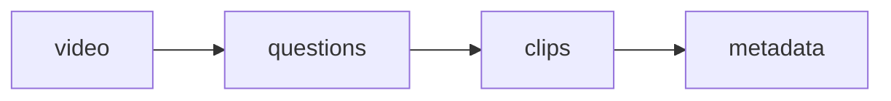

# IMPLEMENTATION_PLAN.md

# AI Content Studio

## Development Roadmap & Execution Plan

Version: 1.0

---

# Development Philosophy

Build the system incrementally.

Each phase must:

* Produce working functionality.
* Be testable independently.
* Have clear acceptance criteria.
* Avoid unnecessary complexity.

Do not move to the next phase until the previous phase works.

---

# Phase 0 — Project Initialization

## Objective

Create the foundation.

---

## Tasks

Create:

```
AI-Content-Studio/

app/

modules/

config/

INPUT/

OUTPUT/

READY_TO_UPLOAD/

TEMP/

logs/
```

Install dependencies:

Core:

* Python 3.11+
* FFmpeg
* OpenCV
* PaddleOCR
* Whisper
* PyYAML

---

## Create

```
requirements.txt
```

Include:

```
opencv-python
paddleocr
openai-whisper
ffmpeg-python
pyyaml
numpy
pandas
moviepy
mediapipe
```

---

## Acceptance Criteria

Running:

```
python app/main.py --help
```

should work.

---

# Phase 1 — Video Analyzer

## Objective

Understand input videos.

---

## Create

```
modules/video/analyzer.py
```

---

## Features

Extract:

* Duration
* Resolution
* FPS
* Codec
* Audio availability

Example output:

```json
{
 "duration":5400,
 "resolution":"1920x1080",
 "fps":30
}
```

---

## Acceptance Criteria

Given:

```
INPUT/livestream.mp4
```

System generates:

```
video_info.json
```

---

# Phase 2 — StreamYard OCR Detection

## Objective

Detect audience questions.

This is the most important module.

---

## Create

```
modules/ocr/detector.py
```

---

## Logic

Process video frames.

Detect:

Question overlay appears:

START

Question overlay disappears:

END

---

## Algorithm

1. Extract frames.
2. Run OCR.
3. Compare OCR output.
4. Detect overlay changes.
5. Save timeline.

---

## Output

```
questions.json
```

Example:

```json
[
 {
 "question":
 "Should I learn AI?",
 "start":
 "00:12:10",
 "end":
 "00:15:40"
 }
]
```

---

## Acceptance Criteria

A 10-minute test video should correctly detect questions.

---

# Phase 3 — Automatic Clip Extraction

## Objective

Create individual answers.

---

## Create

```
modules/video/clipper.py
```

---

## Input

```
questions.json
```

---

## Output

```
OUTPUT/

Question_001/

clip.mp4
```

---

## Requirements

Use FFmpeg.

Maintain:

* Original quality
* Audio sync

---

# Phase 4 — Speech Intelligence

## Objective

Understand spoken content.

---

## Create

```
modules/speech/
```

---

## Features

Generate:

* Transcript
* Subtitle file

Output:

```
transcript.txt

subtitles.srt
```

---

## Rules

Preserve:

* Technical terms
* Product names
* Framework names

---

# Phase 5 — Hook Optimization

## Objective

Improve retention.

---

## Create

```
modules/ai/hooks.py
```

---

## Analyze:

First:

60 seconds

Find:

* Strong statements
* Advice
* Warnings
* Opinions
* Examples

---

## Output:

```json
{
"original_start":"00:12:10",

"recommended_start":"00:12:35",

"hook":
"Most developers learn AI incorrectly"
}
```

---

# Phase 6 — Professional Caption Engine

## Objective

Create premium subtitles.

---

## Create

```
modules/captions/
```

---

## Requirements

Support:

* Keyword highlighting
* Animations
* Brand colors
* Multiple themes

---

## Caption Rules

Maximum:

2 lines

Highlight:

* Java
* AI
* Docker
* Kubernetes
* Architecture

---

# Phase 7 — Video Enhancement

## Objective

Improve quality.

---

## Create

```
modules/video/enhancer.py
```

---

## Apply:

* Audio normalization
* Noise reduction
* Color correction
* Sharpening

---

# Phase 8 — Vertical Video Generator

## Objective

Create social media versions.

---

## Create

```
modules/social/vertical.py
```

---

## Output:

```
vertical.mp4
```

Format:

```
1080x1920
9:16
```

---

## Requirements

Use:

* Face tracking
* Smart crop

---

# Phase 9 — AI Metadata Generator

## Objective

Create publishing content.

---

## Create

```
modules/ai/metadata.py
```

---

## Generate:

* Title
* Description
* Hashtags
* Thumbnail text

---

# Phase 10 — Content Scoring

## Objective

Prioritize best clips.

---

## Create

```
modules/ai/scoring.py
```

---

## Score:

```
Hook

Educational Value

Technical Depth

Audience Fit

Shareability
```

---

Example:

```json
{
"total_score":92,
"priority":"HIGH"
}
```

---

# Phase 11 — Review Dashboard

## Objective

Human approval.

---

## Create:

```
modules/dashboard/
```

---

## Features:

Show:

* Video preview
* Question
* Scores
* Metadata

Actions:

* Approve
* Reject

---

Approved files:

Move to:

```
READY_TO_UPLOAD/
```

---

# Phase 12 — Publishing Automation

Future phase.

Support:

* YouTube API
* Facebook API
* Instagram API
* TikTok API

Do not implement until previous phases are stable.

---

# Testing Strategy

Every module requires:

## Unit Tests

Example:

OCR detector test.

---

## Integration Tests

Full pipeline:



---

# Development Commands

Future CLI:

Process video:

```
python app/main.py process
```

Analyze only:

```
python app/main.py analyze
```

Generate clips:

```
python app/main.py clips
```

Create social version:

```
python app/main.py social
```

---

# Performance Goals

Target:

90-minute livestream.

Expected output:

20-30 clips.

Processing:

<20 minutes on modern hardware.

---

# Code Quality Rules

Claude Code must:

* Write clean Python.
* Use type hints.
* Add comments where needed.
* Keep modules independent.
* Avoid giant files.
* Follow configuration-driven design.

---

# Completion Definition

The project is complete when:

A user can put:

```
livestream.mp4
```

into:

```
INPUT/
```

and receive:

```
20+ professional social media clips

with:

✓ Correct questions
✓ Clean captions
✓ Strong hooks
✓ Vertical format
✓ Titles
✓ Descriptions
✓ Hashtags
✓ Quality scores
```

without manual video editing.
