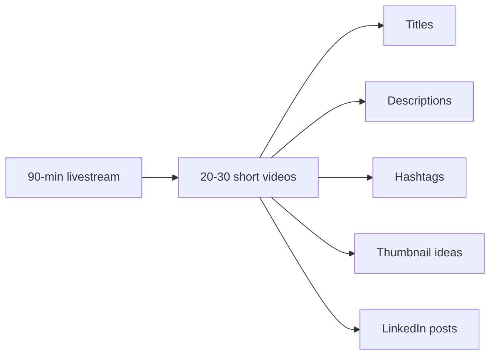
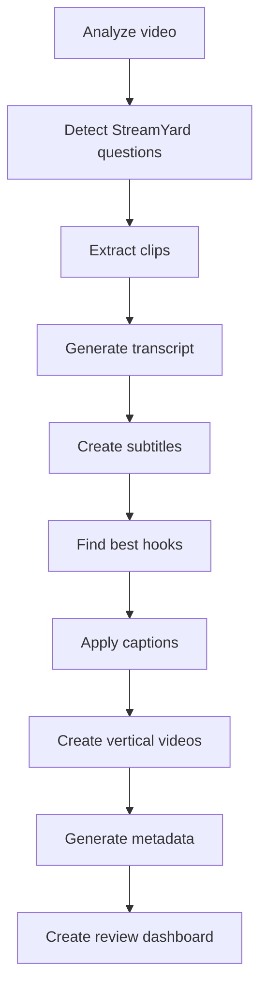

# README.md

# AI Content Studio

## StreamYard Livestream → AI Powered Short-Form Content Generator

Version: 1.0

---

> **▶ To actually produce videos, follow [`RUNBOOK.md`](RUNBOOK.md).** It documents
> the proven, reproducible per-video workflow (question detection, transcription,
> blurred-fit vertical framing, Roman-Urdu captions, and the animated outro), with
> the working scripts in [`pipeline/`](pipeline/) and locked settings in
> `config/settings.yaml` + `config/branding.yaml`. This README describes the
> overall vision; the RUNBOOK is the source of truth for how it's built today.

---

# Using This Repo Yourself

This started as one creator's personal pipeline, tuned for one StreamYard room
and a Roman-Urdu/English speaker — so a few things to know if you're forking it:

* **No cloud API keys required.** Everything runs locally (FFmpeg, Tesseract,
  OpenCV, Whisper). There is nothing to put in a `.env` file to get started.
* **The crop/framing numbers are calibrated, not generic.** `config/settings.yaml`
  (`foreground_crop`, `source_crop`, caption `center_y`, etc.) and the face crop
  described in `RUNBOOK.md` were measured against one person's camera framing.
  Re-measure these for your own footage — see RUNBOOK.md §"Smart Cropping" /
  "Environment gotchas".
* **`config/branding.yaml` is a real creator's identity** (name, handle, colors)
  used as the shipped default outro/name-tag branding — swap it for your own
  before publishing videos.
* **Media is intentionally not in this repo.** `INPUT/`, `OUTPUT/`,
  `READY_TO_UPLOAD/`, `TEMP/`, `logs/*`, and all `*.mp4`/`*.mov`/`*.mkv`/`*.wav`
  files are gitignored (see `.gitignore`) — only the code and config templates
  are version-controlled. Drop your own livestream file into `INPUT/` locally.
* **The real, working entry point is `pipeline/process_question.py`**, not the
  `app/main.py` CLI described later in this file (that CLI is aspirational —
  see the note under "CLI Commands"). Follow `RUNBOOK.md` to actually produce a
  video.

---

# Overview

AI Content Studio is an automated content production pipeline designed for software engineering creators.

It converts long-form livestream recordings into professional short-form videos.

The system automatically:

* Detects StreamYard audience questions
* Extracts individual answers
* Generates subtitles
* Creates professional captions
* Improves video quality
* Creates TikTok/Reels/Shorts versions
* Generates titles and descriptions
* Scores content quality
* Creates an approval workflow

---

# Target Content

This system is optimized for:

* Software Engineering
* Java
* Spring Boot
* Docker
* Kubernetes
* Cloud
* AI Engineering
* System Design
* Developer Career Advice
* Technical Mentoring

---

# Final Output

One 90-minute livestream becomes a batch of publish-ready deliverables per question:



---

# Project Structure

```
AI-Content-Studio/

│
├── CLAUDE.md
├── ARCHITECTURE.md
├── CONFIGURATION.md
├── IMPLEMENTATION_PLAN.md
├── PROMPTS.md
│
├── app/
│   └── main.py
│
├── modules/
│
│   ├── video/
│   ├── ocr/
│   ├── speech/
│   ├── captions/
│   ├── ai/
│   ├── social/
│   └── dashboard/
│
├── config/
│
│   ├── branding.yaml
│   └── settings.yaml
│
├── INPUT/
│
├── OUTPUT/
│
├── READY_TO_UPLOAD/
│
├── TEMP/
│
└── logs/
```

---

# Requirements

## Operating System

Supported:

* macOS
* Linux
* Windows with WSL

Recommended:

macOS/Linux

---

# Software Requirements

Install:

## Python

Version:

```
Python 3.11+
```

Check:

```bash
python --version
```

---

## FFmpeg

Required for video processing.

Check:

```bash
ffmpeg -version
```

---

# Python Environment Setup

Create environment:

```bash
python -m venv venv
```

Activate:

## macOS/Linux

```bash
source venv/bin/activate
```

## Windows

```bash
venv\Scripts\activate
```

---

Install dependencies:

```bash
pip install -r requirements.txt
```

---

# First Run

Place your livestream:

```
INPUT/

    livestream.mp4
```

Run:

```bash
python app/main.py process
```

---

# Processing Flow



---

# Output Example

After processing:

```
OUTPUT/

Question_001/

    clip.mp4

    vertical.mp4

    subtitles.srt

    question.txt

    title.txt

    description.txt

    hashtags.txt

    metadata.json
```

---

# Review Process

Open:

```
review.html
```

Review:

* Video quality
* Caption quality
* Title
* Description
* AI score

Approve selected clips.

Approved clips move to:

```
READY_TO_UPLOAD/
```

---

# CLI Commands

> The commands in this section belong to the planned `app/` entry point. The
> **working** per-question workflow is the `pipeline/` one — see
> [RUNBOOK.md](./RUNBOOK.md):
>
> ```bash
> python3 pipeline/trim.py <stream>.mp4 <clip>.mp4 --start 18:03 --end 19:27
> python3 pipeline/transcribe.py <clip>.mp4 <Q_dir> large-v3 ur
> python3 pipeline/process_question.py <clip>.mp4 <Q_dir>          # add --draft to iterate
> ```

## Process Everything

```bash
python app/main.py process
```

---

## Analyze Video Only

```bash
python app/main.py analyze
```

---

## Detect Questions

```bash
python app/main.py ocr
```

---

## Generate Clips

```bash
python app/main.py clips
```

---

## Generate Social Videos

```bash
python app/main.py social
```

---

## Generate Metadata

```bash
python app/main.py metadata
```

---

# Configuration

All customization happens through:

```
config/
```

---

## Branding

File:

```
config/branding.yaml
```

Controls:

* Creator name
* Fonts
* Colors
* Caption style
* Lower thirds

---

## Processing

File:

```
config/settings.yaml
```

Controls:

* AI models
* Video quality
* OCR settings
* Export settings

---

# Caption Style

The system follows a premium developer-focused style.

Characteristics:

* Clean typography
* Minimal animations
* Technical keyword highlighting
* High readability

Example:

```
Most developers ignore

SYSTEM DESIGN
when learning coding.
```

---

# AI Models

## OCR

Primary:

```
PaddleOCR
```

---

## Speech

Primary:

```
Whisper Large v3
```

---

## Computer Vision

Used for:

* Face tracking
* Smart cropping
* Screen detection

Technology:

```
OpenCV
MediaPipe
```

---

# Development Approach

Build in phases:

## Phase 1

Basic pipeline:

* OCR
* Clip extraction
* Transcript

## Phase 2

Professional editing:

* Captions
* Branding
* Vertical videos

## Phase 3

AI intelligence:

* Hooks
* Scoring
* Metadata

## Phase 4

Automation:

* Publishing
* Analytics
* Content calendar

---

# Troubleshooting

## OCR Not Detecting Questions

Check:

* StreamYard overlay visibility
* OCR confidence threshold
* Frame interval

Configuration:

```
config/settings.yaml
```

---

## Poor Subtitle Quality

Check:

* Whisper model
* Audio quality
* Language detection

---

## Slow Processing

Improve:

* GPU acceleration
* Frame sampling interval
* FFmpeg settings

---

# Future Roadmap

Planned features:

* Automatic YouTube Shorts upload
* TikTok publishing
* Facebook publishing
* Audience analytics
* Content recommendation engine
* Personal knowledge base
* AI course generation

---

# Contribution Guidelines

Any code added should:

* Follow existing architecture
* Use configuration files
* Include logging
* Include tests
* Avoid hardcoded values

---

# Project Philosophy

This is not just a video editing tool.

It is an AI-powered content studio designed to help a software engineering educator consistently publish high-quality technical content.

The system should behave like:

```
Video Editor

+

Technical Editor

+

Content Strategist

+

Social Media Manager
```

---

# Success Criteria

The system is successful when:

A creator finishes a livestream,

drops one video file,

runs one command,

and receives professional, publish-ready technical content.
