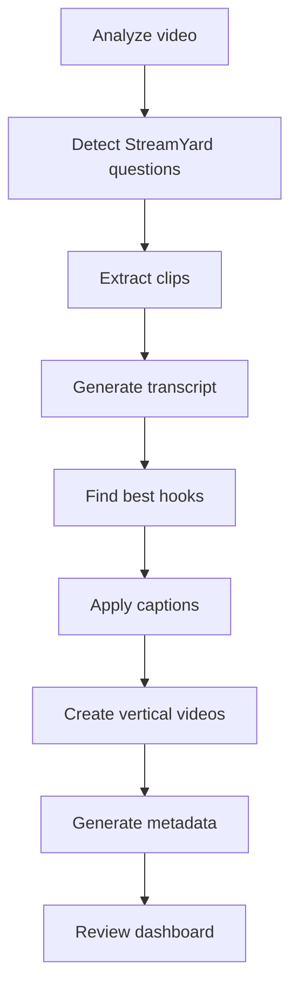
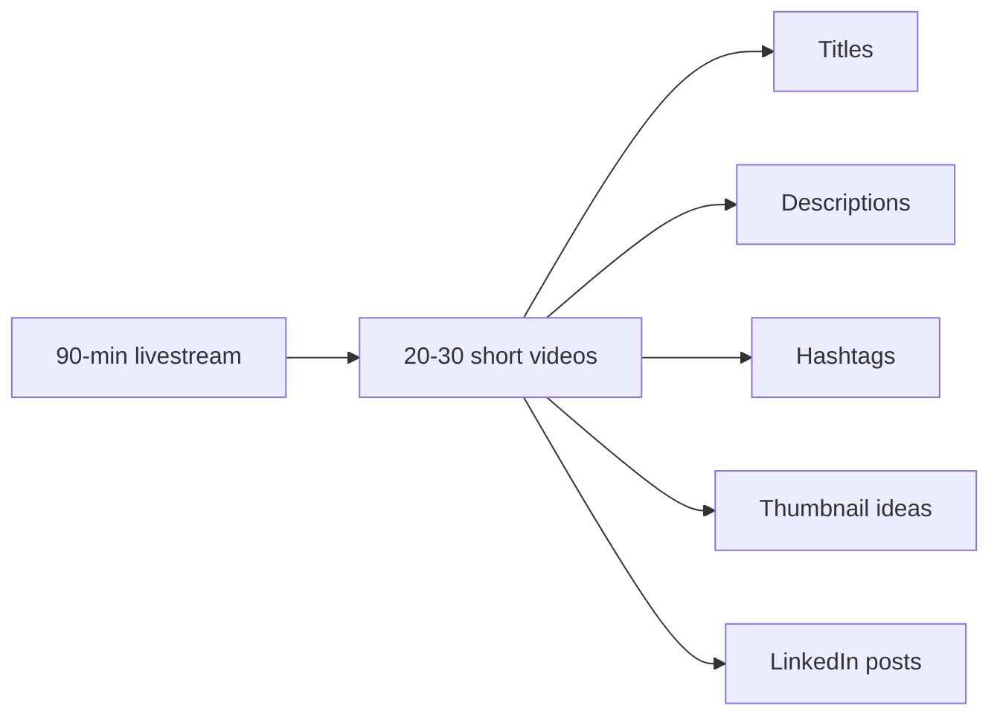

<div align="center">

# AI Content Studio

### StreamYard Livestream → AI-Powered Short-Form Content Generator

[](https://www.python.org/)
[](https://ffmpeg.org/)
[]()
[]()
[]()

**One command turns a 90-minute livestream into 20-30 publish-ready vertical reels** —
clipped, transcribed, captioned, branded, scored, and ready for review.

[Quick Start](#quick-start) •
[How It Works](#how-it-works) •
[Using This Repo Yourself](#using-this-repo-yourself) •
[Configuration](#configuration) •
[Troubleshooting](#troubleshooting)

</div>

---

> **▶ To actually produce videos, follow [`RUNBOOK.md`](RUNBOOK.md).** It documents
> the proven, reproducible per-video workflow (question detection, transcription,
> blurred-fit vertical framing, Roman-Urdu captions, and the animated outro), with
> the working scripts in [`pipeline/`](pipeline/) and locked settings in
> `config/settings.yaml` + `config/branding.yaml`. This README describes the
> overall vision; the RUNBOOK is the source of truth for how it's built today.

---

## Using This Repo Yourself

This started as one creator's personal pipeline, tuned for one StreamYard room
and a Roman-Urdu/English speaker — so a few things to know if you're forking it:

| | |
|---|---|
| **No cloud API keys** | Everything runs locally (FFmpeg, Tesseract, OpenCV, Whisper). Nothing to put in a `.env` file to get started. |
| **Crop/framing is calibrated, not generic** | `config/settings.yaml` (`foreground_crop`, `source_crop`, caption `center_y`, etc.) and the face crop in `RUNBOOK.md` were measured against one person's camera framing. Re-measure for your own footage — see RUNBOOK.md §"Smart Cropping" / "Environment gotchas". |
| **Branding is a real identity** | `config/branding.yaml` ships with the original creator's name, handle, and colors as the default outro/name-tag branding — swap it for your own before publishing. |
| **No media in this repo** | `INPUT/`, `OUTPUT/`, `READY_TO_UPLOAD/`, `TEMP/`, `logs/*`, and all `*.mp4`/`*.mov`/`*.mkv`/`*.wav` files are gitignored — only code and config templates are version-controlled. Drop your own livestream into `INPUT/` locally. |
| **Real entry point** | `pipeline/process_question.py` is the working, battle-tested tool. The `app/main.py` CLI described further down is aspirational — see the note under [CLI Commands](#cli-commands). Follow `RUNBOOK.md` to actually produce a video. |

---

## Overview

AI Content Studio is an automated content production pipeline for software engineering
creators. It converts long-form livestream recordings into professional short-form
videos — automatically:

- Detecting StreamYard audience questions
- Extracting individual answers into clips
- Generating subtitles and professional captions
- Improving video quality (audio, color, sharpening)
- Creating TikTok / Reels / Shorts vertical versions
- Generating titles, descriptions, and hashtags
- Scoring content quality
- Building an approval workflow

**Optimized for:** Software Engineering · Java · Spring Boot · Docker · Kubernetes ·
Cloud · AI Engineering · System Design · Developer Career Advice · Technical Mentoring

---

## How It Works



One 90-minute livestream becomes a batch of publish-ready deliverables per question:



---

## Quick Start

```bash
# 1. Check prerequisites
python --version     # 3.11+
ffmpeg -version       # required for all video processing

# 2. Set up the environment
python -m venv venv
source venv/bin/activate        # Windows: venv\Scripts\activate
pip install -r requirements.txt

# 3. Drop your livestream in
mkdir -p INPUT && cp /path/to/your/livestream.mp4 INPUT/

# 4. Run the real per-question pipeline (see RUNBOOK.md for the full workflow)
python3 pipeline/trim.py INPUT/livestream.mp4 clip.mp4 --start 18:03 --end 19:27
python3 pipeline/transcribe.py clip.mp4 Q_dir large-v3 ur
python3 pipeline/process_question.py clip.mp4 Q_dir
```

| Requirement | Notes |
|---|---|
| **OS** | macOS or Linux recommended; Windows works via WSL |
| **Python** | 3.11+ |
| **FFmpeg** | No cloud transcoding — all video processing is local |

Output lands in `OUTPUT/Question_001/` with `clip.mp4`, `vertical.mp4`, `subtitles.srt`,
`title.txt`, `description.txt`, `hashtags.txt`, and `metadata.json`. Review in
`review.html`, approve, and approved clips move to `READY_TO_UPLOAD/`.

---

## Project Structure

```
AI-Content-Studio/
├── CLAUDE.md
├── ARCHITECTURE.md
├── CONFIGURATION.md
├── IMPLEMENTATION_PLAN.md
├── PROMPTS.md
├── RUNBOOK.md              ← the real, working workflow
│
├── app/
│   └── main.py              (planned CLI — see note below)
├── pipeline/                 ← the real, working scripts
├── modules/
│   ├── video/  ocr/  speech/  captions/  ai/  social/  dashboard/
│
├── config/
│   ├── branding.yaml
│   └── settings.yaml
│
├── INPUT/  OUTPUT/  READY_TO_UPLOAD/  TEMP/  logs/   ← gitignored contents
```

---

## Configuration

All customization happens through `config/`:

| File | Controls |
|---|---|
| `config/branding.yaml` | Creator name, fonts, colors, caption style, lower thirds |
| `config/settings.yaml` | AI models, video quality, OCR settings, export settings |

### Caption Style

Premium developer-focused style — clean typography, minimal animations, technical
keyword highlighting, high readability:

```
Most developers ignore

SYSTEM DESIGN
when learning coding.
```

### Models & Tooling

| Purpose | Tool |
|---|---|
| OCR | Tesseract (see RUNBOOK.md for why over PaddleOCR/EasyOCR) |
| Speech | Whisper (`large-v3` for best captions) |
| Computer Vision | OpenCV — face tracking, smart cropping, screen-share detection |

---

<details>
<summary><strong>CLI Commands (planned <code>app/</code> entry point)</strong></summary>

> The commands below belong to the **planned** `app/` entry point, which is not yet
> implemented. The **working** per-question workflow is the `pipeline/` one — see
> [RUNBOOK.md](./RUNBOOK.md):
>
> ```bash
> python3 pipeline/trim.py <stream>.mp4 <clip>.mp4 --start 18:03 --end 19:27
> python3 pipeline/transcribe.py <clip>.mp4 <Q_dir> large-v3 ur
> python3 pipeline/process_question.py <clip>.mp4 <Q_dir>          # add --draft to iterate
> ```

```bash
python app/main.py process    # process everything
python app/main.py analyze    # analyze video only
python app/main.py ocr        # detect questions
python app/main.py clips      # generate clips
python app/main.py social     # generate social videos
python app/main.py metadata   # generate metadata
```

</details>

<details>
<summary><strong>Development Approach</strong></summary>

| Phase | Focus |
|---|---|
| 1 | Basic pipeline — OCR, clip extraction, transcript |
| 2 | Professional editing — captions, branding, vertical videos |
| 3 | AI intelligence — hooks, scoring, metadata |
| 4 | Automation — publishing, analytics, content calendar |

**Contribution guidelines:** follow existing architecture, use configuration files,
include logging, include tests, avoid hardcoded values.

</details>

<details>
<summary><strong>Troubleshooting</strong></summary>

**OCR not detecting questions** — check StreamYard overlay visibility, OCR confidence
threshold, and frame interval in `config/settings.yaml`.

**Poor subtitle quality** — check Whisper model size, audio quality, and language
detection.

**Slow processing** — try GPU acceleration, a wider frame sampling interval, or
lighter FFmpeg settings.

</details>

<details>
<summary><strong>Future Roadmap</strong></summary>

- Automatic YouTube Shorts / TikTok / Facebook publishing
- Audience analytics
- Content recommendation engine
- Personal knowledge base
- AI course generation

</details>

---

<div align="center">

**Project Philosophy:** not just a video editor — a Video Editor + Technical Editor +
Content Strategist + Social Media Manager, in one pipeline.

*Success looks like: a creator finishes a livestream, drops one file, runs one
command, and gets professional, publish-ready technical content.*

</div>
